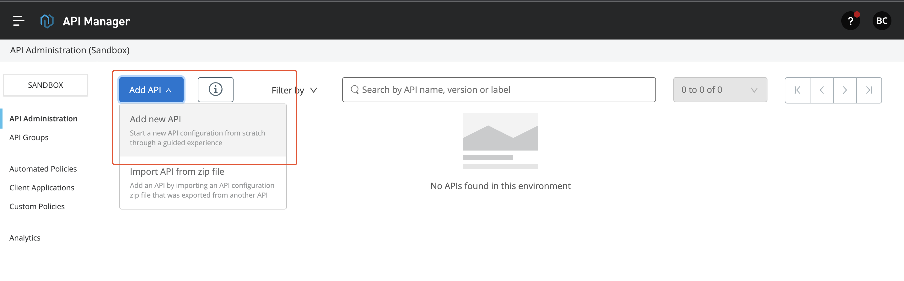
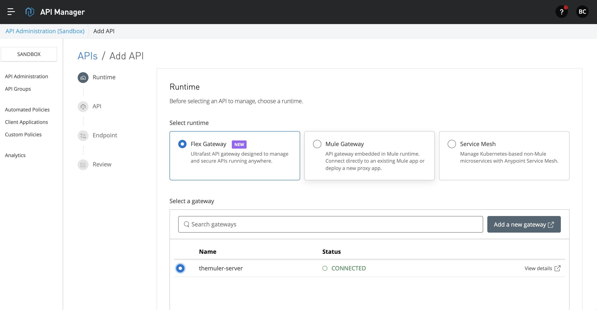
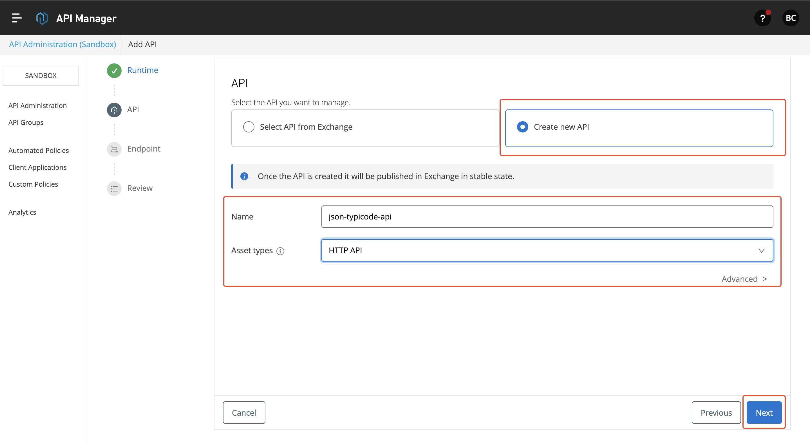
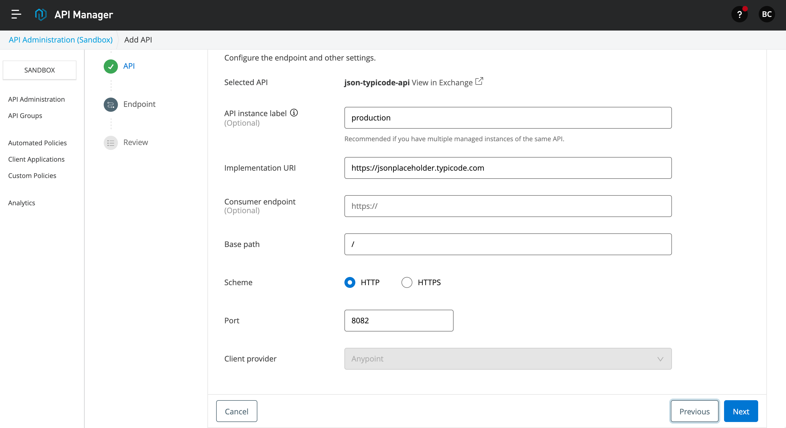
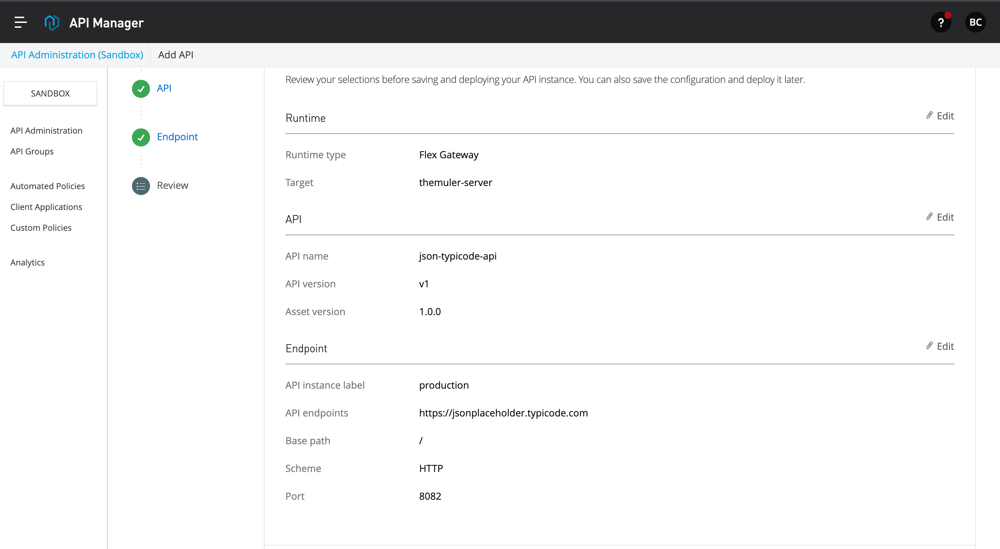
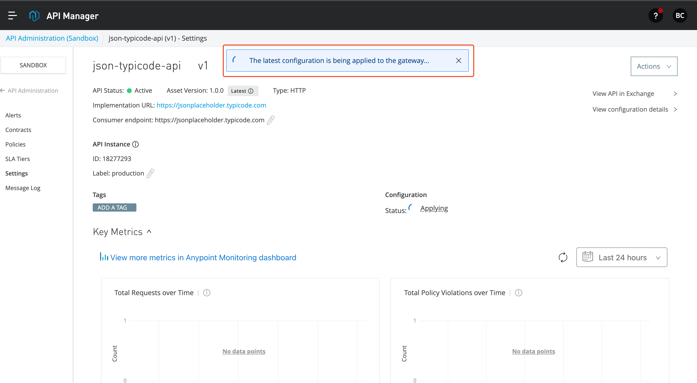
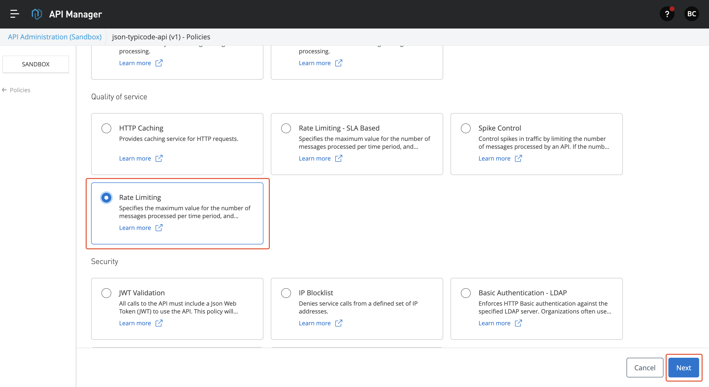
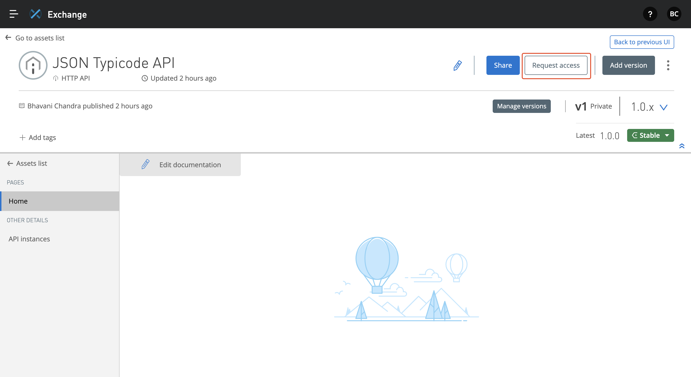
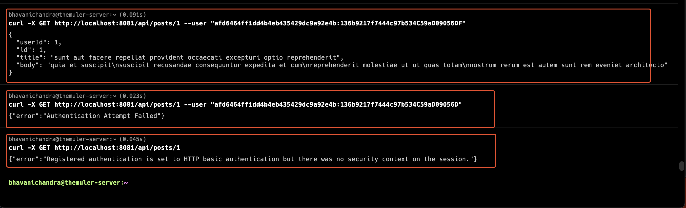
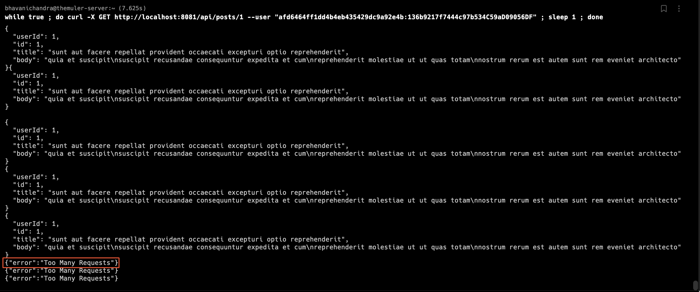

## Introduction

* MuleSoft's Flex gateway is an ultrafast way to manage and secure APIs running in a server/container with full capabilities offered by MuleSoft's API Manager.
    
* MuleSoft's API Manager provides an industry-leading way to manage API using policies. A policy can be applied to an API to manage its behavior without any code changes. These are applied at the gateway level.
    
* There are various policies provided by MuleSoft, such as
    
    * Cross-Origin Resource Sharing (CORS)
        
    * OAuth0 Authentication Policy
        
    * Client ID Enforcement.
        
* And many other policies are supported by MuleSoft. Visit [MuleSoft docs](https://docs.mulesoft.com/gateway/1.1/policies-included-directory) to see the actual list of policies supported by flex gateway.
    

## Steps to use Flex Gateway

In this blog post, I'm going to demonstrate using a Linux box I have. I have a simple User Management API developed in Python (Fast API). API allows an Admin user to manage users, profiles and permissions. For this blog post, I choose the following policies, such as Logging Policy and Rate Limiting with SLA policy.

### Prerequisites:

The following prerequisites are needed,

* Anypoint Platform access. To try it, you can create a 30-day trial at [this](https://anypoint.mulesoft.com/login/signup) page
    
* API you have developed in another language other than Mule
    
* Linux Server
    

### Install Flex Gateway

* In Runtime Manager, click on Flex Gateways in the side menu.
    
* From there, click on Add Gateway button.
    
* Select the Linux option and follow the steps mentioned there to install the Flex gateway in a Linux box.
    
* Use the below command to install **flex-gateway** to the Linux server
    

```bash
curl -XGET https://flex-packages.anypoint.mulesoft.com/ubuntu/pubkey.gpg | sudo apt-key add -
echo "deb https://flex-packages.anypoint.mulesoft.com/ubuntu $(lsb_release -cs) main" \
  | sudo tee /etc/apt/sources.list.d/mulesoft.list
sudo apt update
sudo apt install -y flex-gateway
```

* Use the below command to start the flex gateway
    

```bash
sudo systemctl start flex-gateway
```

* Once it's installed, execute the below command to start the flex gateway, register it in Runtime Manager
    

```bash
sudo flexctl register <GatewayName> \
  --token=a8c34b42-a6be-4c82-92be-db7496983289 \
  --organization=0de7096a-6bf0-422c-a567-7450c69c0405 \
  --connected=true \
  --output-directory=/usr/local/share/mulesoft/flex-gateway/conf.d
```

* You can also check the related services using the below command
    

```bash
sudo systemctl list-units flex-gateway*
```

### API Manager Configuration

* Once your application is deployed to your server, we need the implementation URL for the application
    
* Go to API Manager, and click on Add API button at the top of the page. Click on **Add New API**.
    



* In the Add API page, select the Flex gateway and select the gateway you have added above. Click Next to continue.
    



* In the next page, you can either select API from the exchange or create a new API. Give the appropriate name and asset type based on your API. For this blog, I selected HTTP API. I'm going to interface JSON Typicode API and manage it. Click Next to continue.
    



* In the next page, you can add the endpoint details, base path and port. Click on Next to continue.
    



* Here, you can see the full summary of the flex gateway API configuration. After this, click on the Save and Deploy API button below.
    



* API manager deploys the API to the flex gateway, and it will apply the API configuration to the flex gateway.
    



* In this article, I am going to apply two policies: Go to the policies page and select Rate-Limiting Policy.
    
* Rate-Limiting Policy: This policy is used to set a compliant limit on the API. Restrict unnecessary calls to API.
    
* Add the necessary configuration to enable the policy
    



* Next Select, Client ID Enforcement and select Basic Authentication as the credential origin.
    
* Now, to access the API, we need the client ID and client secret. Go to the Exchange and click on the **Request Access** button. Follow through the creation process and get the tokens.
    



* Once you got the access, you can go to the server where flex gateway is created and use localhost to make API calls as shown below
    



* In the above screenshot,
    
    * The first call is made to users/1 endpoint with a client ID and Client Secret with Basic Authentication
        
    * The next Call is made with an invalid Client Secret, which throws an error out, as the client secret is wrong
        
    * The Last call in this image shows that a call is made without a basic authentication header.
        
* From these above calls, we can be sure that Client ID Enforcement is applied to the API.
    
* In the next HTTP call, I called the API every second to trigger the Rate-Limiting policy. You can see Too Many Requests' response, which indicates the policy worked.
    



## Sources:

* MuleSoft Documentation - https://docs.mulesoft.com
    
* MuleSoft Blog Posts
    

## Thank You

Feel free to comment, or reach out. Thanks for your time.